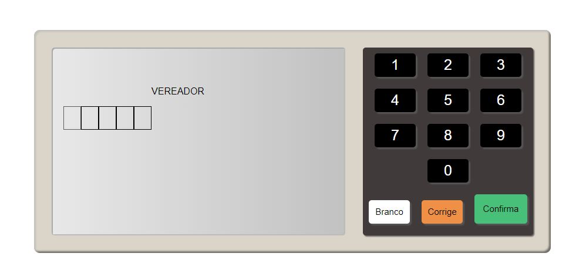

<h1> Projeto de Urna Eletrônica Utilizando HTML, CSS e JS </h1>

    <h3>Números de Candidatos válidos</h3>
    
Vereador:

    <ul>
        <li>38111</li>
        <li>77222</li>
    </ul>
    
Prefeito:

    <ul>
        <li>99</li>
        <li>84</li>
    </ul>

    